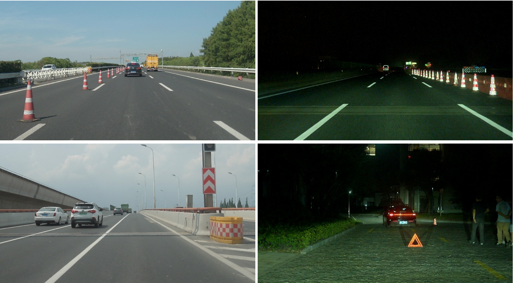
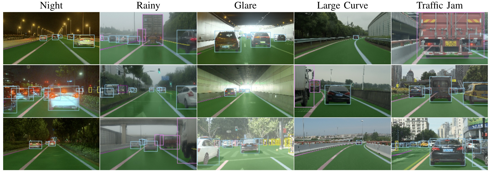
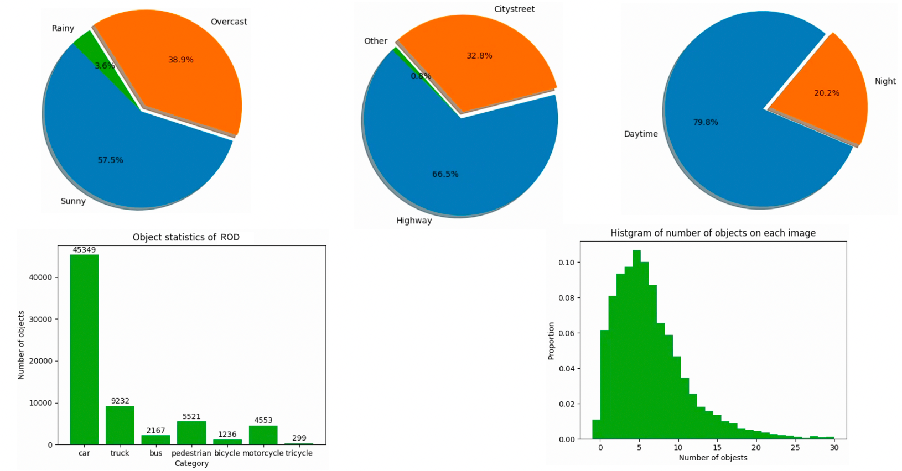

<br>
## Abstract

Detection of rare objects (e.g., traffic cones, traffic barrels and traffic warning triangles) is an important perception task to improve the safety of autonomous driving. Training of such models typically requires a large number of annotated data which is expensive and time consuming to obtain. To address the above problem, an emerging approach is to apply data augmentation to automatically generate costfree training samples. In this work, we propose a systematic study on simple Copy-Paste data augmentation for rare object detection in autonomous driving. Specifically, local adaptive instance-level image transformation is introduced to generate realistic rare object masks from source domain to the target domain. Moreover, traffic scene context is utilized to guide the placement of masks of rare objects. To this end, our data augmentation generates training data with high quality and realistic characteristics by leveraging both local and global consistency. In addition, we build a new dataset named ROD consisting 10k training images, 4k validation images and the corresponding labels with a diverse range of scenarios in autonomous driving. Experiments on ROD dataset show that our method achieves promising results on rare object detection. We also present a thorough study to illustrate the effectiveness of our local-adaptive and global constraints based Copy-Paste data augmentation for rare object detection. For more details, please refer to [our paper](https://arxiv.org/pdf/2205.00376.pdf).

## Reference
  * Traffic Context Aware Data Augmentation for Rare Object Detection in Autonomous Driving},<br>
  Naifan Li, Fan Song, Ying Zhang, Pengpeng Liang, Erkang Cheng<br>
  ICRA, 2022

## ROD



**ROD** is a new diverse real-world dataset from [Nullmax](http://nullmax.ai/), consisting **10k training images (640x384)**, **4k validation images (640x384)** and corresponding 2D bounding box annotations with 5 representative object categories (car, truck, bus, pedestrian, bicycle). The dataset also covers a diverse range of scenarios, such as different road grades (e.g. highway, expressway, city street and country road), different weathers (e.g. sunny, cloudy and rainy) and different times of day (e.g. daytime, evening and night). In addition, we also make 1k traffic cone masks, 100 traffic barrel masks, and 50 traffic warning triangle masks available to the community. 

Below is the statistics of our ROD dataset:




## Downloads
**Google Drive** and **Baidu Cloud** links are available for the downloading of training and testing data.

For each training images, we manually annotate the 2D bounding box annotations with 5 representative object catgories. In addition, the global traffic scene contexts (e.g., freespace, common objects and traffic lanes) are obtained from a multi-task deep model containing three heads: (1) one semantic segmentation head for freespace segmentation; (2) another instance segmentation head for traffic lane segmentation and (3) a detection head for common road users detection.

**Training data**

|Data Type|Google Drive|Baidu Cloud|
|:-:|:-:|:-:|
|Image|[Download](https://drive.google.com/file/d/1lpCxFMr44tlsw7_lmxUvAEtfgK1Hyfc3/view?usp=sharing)|[Download (Extraction Code: 1w2g)](https://pan.baidu.com/s/12Jf06U_whDviTTUDbLxrcw)|
|2D label|[Download](https://drive.google.com/file/d/1t0x6R-CMsjzjvdURB0P_oj9kNCQi2mZc/view?usp=sharing)|[Download (Extraction Code: akmg)](https://pan.baidu.com/s/1Gl1Fv3XregiUT6yPm8RATg)|

**Testing data**

|Data Type|Google Drive|Baidu Cloud|
|:-:|:-:|:-:|
|Image|[Download](https://drive.google.com/file/d/1iUFxtZ3rzAGNeO-Rnm0fYODY23RSufr-/view?usp=sharing)|[Download (Extraction Code: ivtv)](https://pan.baidu.com/s/12tbCOccTSNTid4t3VnEyMg)|
|2D label|[Download](https://drive.google.com/file/d/14dmIBNj67KlLr21WR6DbE-Ff65TG6M9k/view?usp=sharing)|[Download (Extraction Code: e9sc)](https://pan.baidu.com/s/1uNIHTgNTg3Wu68w-RY77Dw)|

**Supplementary data**
<!-- |Freespace segmentation|[Download](https://drive.google.com/file/d/1EvO29Zi_6U7qOUDw49BssTy11iifRg-e/view?usp=sharing)|[Download (Extraction Code: w1ux)](https://pan.baidu.com/s/1gnT8PTsLjulyV2fHNTC5JA)|
|Lane segmentation|[Download](https://drive.google.com/file/d/1fGM-6PuHkkNChUf_8efsIV5UHl_yl7He/view?usp=sharing)|[Download (Extraction Code: e2pg)](https://pan.baidu.com/s/1_el9sHY1dQzd6r50MQukBA)| -->

|Data Type| Google Drive|Baidu Cloud|
|:-:|:-:|:-:|
|Traffic cone mask|[Download](https://drive.google.com/file/d/1GwcB_eqb20pW_0cEuUc3mPjaFuA7wTq8/view?usp=sharing)|[Download (Extraction Code: mjda)](https://pan.baidu.com/s/1KKZ5i4GXejwXbv4oOYW1AA)|
|Traffic barrel mask|[Download](https://drive.google.com/file/d/1LZd8--LC0V77GUcOawPbTToAyWFs5k3k/view?usp=sharing)|[Download (Extraction Code: vs8x)](https://pan.baidu.com/s/1upaFHjAQUEnaG-Dam8360A)|
|Traffic warning triangle mask|[Download](https://drive.google.com/file/d/11P_Cq9ziqbzZPqiMm7VTkH2HhsYSqQ07/view?usp=sharing)|[Download (Extraction Code: 5wqf)](https://pan.baidu.com/s/1hWU8EuRDTVXiOxIcaSLGug)|

**Devkit**

Please refer to [cocoapi](https://github.com/cocodataset/cocoapi) for evaluation. In addition, we provide a [view.py](https://github.com/nullmax-vision/nullmax-vision.github.io/blob/main/scripts/view.py) script to enable you familiar with this dataset. 

## Contact
{chengerkang, linaifan, zhangying}@nullmax.ai

## Citation
```cite
@article{li2022traffic,
 title={Traffic Context Aware Data Augmentation for Rare Object Detection in Autonomous Driving},
 author={Li, Naifan and Song, Fan and Zhang, Ying and Liang, Pengpeng and Cheng, Erkang},
 booktitle={2022 IEEE International Conference on Robotics and Automation (ICRA)},
 year={2022},
 organization={IEEE}
}
```